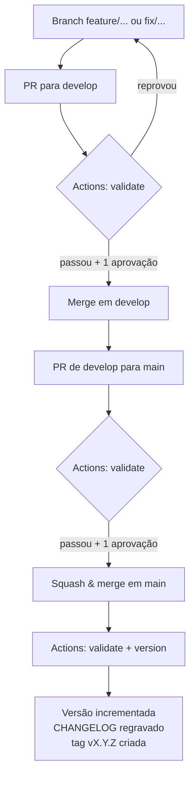

# Guia de Contribuição

Como contribuir com este repositório e, principalmente, **como escrever um commit
que apareça bem no [CHANGELOG](CHANGELOG.md)**.

Você não escreve o changelog à mão. Você escreve boas mensagens de commit e um
bom título de Pull Request — o arquivo é gerado pela pipeline
([`.github/workflows/release.yml`](.github/workflows/release.yml)).

As regras de conteúdo e o fluxo de revisão documental estão no
[AGENTS.md](AGENTS.md); aqui o assunto é o fluxo de código e publicação.

---

## 1. O ciclo completo



O job `version` roda **apenas em `main`** e **apenas fora de PR**. Merge em
`develop` nunca publica versão — isso é intencional.

---

## 2. As ferramentas

Nenhuma delas é código deste repositório: são ferramentas de mercado,
configuradas por arquivo.

| Ferramenta | Para quê | Configuração |
| --- | --- | --- |
| [git-cliff](https://git-cliff.org) | Gera o CHANGELOG e calcula a próxima versão a partir dos commits | [`cliff.toml`](cliff.toml) |
| [cargo-edit](https://github.com/killercup/cargo-edit) | `cargo set-version` atualiza `Cargo.toml` e `Cargo.lock` | — |
| [markdown-link-check](https://github.com/marketplace/actions/markdown-link-checker) | Verifica os links dos `.md` | [`.github/workflows/mlc_config.json`](.github/workflows/mlc_config.json) |

O `mlc_config.json` tem duas exceções, ambas por falso positivo:

- **links para o próprio repositório** — as URLs de commit e de tag que o
  git-cliff gera apontam para objetos que só existem depois do push, e dariam
  404 na verificação;
- **`www.iso.org`** — o site responde `403` a requisições automatizadas. O link
  funciona no navegador; quem falha é o verificador.

---

## 3. A mensagem de commit

Use [Conventional Commits](https://www.conventionalcommits.org/pt-br/). O
changelog segue o [Keep a Changelog 1.1.0](https://keepachangelog.com/pt-BR/1.1.0/),
com datas em [ISO 8601](https://www.iso.org/iso-8601-date-and-time-format.html)
(`AAAA-MM-DD`).

```
tipo(escopo opcional): descrição no imperativo

corpo opcional explicando o porquê
```

### Onde cada tipo aparece

| Tipo do commit | Seção do changelog | Incremento |
| --- | --- | --- |
| `feat:` | Adicionado | MINOR |
| `fix:` | Corrigido | PATCH |
| `docs:`, `refactor:`, `perf:`, `style:`, `build:`, `ci:`, `chore:`, `test:`, `revert:` | Modificado | PATCH |
| `deprecate:` | Obsoleto | PATCH |
| `remove:` | Removido | PATCH |
| `security:` | Segurança | PATCH |
| qualquer outra coisa | Outras alterações | PATCH |
| `tipo!:` ou `BREAKING CHANGE:` no corpo | a seção do tipo, com o rótulo **Mudança importante** | MAJOR |

As seis primeiras seções são as do Keep a Changelog. *Outras alterações* existe
para tornar visível o commit que não seguiu o padrão — se algo seu cair ali,
melhore a mensagem antes do merge.

> `refact:` é aceito como sinônimo de `refactor:`, porque já foi usado no
> histórico do repositório — mas prefira `refactor:` em commits novos.

### Escreva pensando em quem vai ler a versão publicada

A descrição do commit vira, literalmente, uma linha do changelog. Quem lê é
alguém decidindo se precisa mudar como trabalha — não é code review.

| Evite | Prefira |
| --- | --- |
| `fix: ajustes` | `fix: corrigir detecção de sucesso na conversão para PDF` |
| `feat: novo script` | `feat: adicionar conversor de Markdown para DOCX` |
| `docs: update` | `docs: documentar o fluxo de revisão do Projeto X` |
| `wip` | qualquer coisa com um tipo válido |

O escopo, quando existir, vira destaque na entrada:
`feat(skills): adicionar skill wiki-writer` → **skills**: Adicionar skill wiki-writer.

### Mudanças importantes

Use `!` (ou `BREAKING CHANGE:` no corpo) quando a mudança **altera a forma de
trabalhar** do time — não quando ela é grande em tamanho, e sim em impacto.
Renomear uma pasta que todos os projetos derivados copiam é breaking; adicionar
um script novo não é.

---

## 4. A Pull Request

1. Abra a PR de `feature/...` para `develop`.
2. Quando `develop` estiver pronta para publicar, abra a PR de `develop` para `main`.
3. **O título da PR segue Conventional Commits** — é ele que define a versão.
4. Na descrição, responda: o quê, por quê e como testar.
5. Aguarde o job `validate` ficar verde.
6. Use **Squash and merge**.

O método de merge importa: no *squash*, o assunto do commit é o título da PR, e
é esse assunto que o git-cliff analisa. Com *merge commit*, o assunto vira
`Merge pull request #N from ...` — que o `cliff.toml` descarta, e a análise
cairia sempre em PATCH.

---

## 5. Rodar as verificações antes de abrir a PR

```bash
cargo build --release --locked      # compila md2docx e docx_to_pdf
cargo test --locked

cargo install git-cliff --locked    # uma vez
git cliff --unreleased              # o que entraria na próxima versão
git cliff --bumped-version          # qual seria a próxima versão
```

A prévia imprime exatamente as entradas que irão para o changelog. Se alguma
estiver em *Outras alterações* ou com texto ruim, ainda dá tempo de melhorar a
mensagem de commit (`git commit --amend` ou `git rebase -i`).

Para forçar um incremento numa publicação, use **Actions → release → Run
workflow** e escolha `version_bump` como `major`, `minor` ou `patch`.

---

## 6. Ativação da pipeline

O repositório ainda não tem tags: a primeira execução do job `version` publica a
**v0.1.0** com todo o histórico e cria a tag. Não há passo manual de preparação —
mas as permissões abaixo precisam estar em ordem, senão o push do release falha:

- [ ] **Permissão de escrita**: `permissions: contents: write` já está no
      workflow. Confira também em *Settings → Actions → General → Workflow
      permissions* se está como *Read and write*.

- [ ] **Proteção de branch em `main`**: se `main` exigir PR para receber commits,
      o push do release é rejeitado — o `GITHUB_TOKEN` padrão não fura essa
      regra. Saídas: liberar o bot em *Allow specified actors to bypass required
      pull requests*, ou criar um PAT/GitHub App com escopo `contents: write` e
      salvá-lo como o secret `RELEASE_TOKEN` (o workflow já o usa quando existe).

- [ ] **Status check**: exigir o job `validate` em `main` e `develop`.

- [ ] **Squash merging** como método padrão, para manter a regra "título define
      versão".

Sobre o `[skip ci]` no commit de release: eventos causados pelo `GITHUB_TOKEN`
padrão não disparam novos workflows, o que já evita o loop. Se você adotar
`RELEASE_TOKEN`, os eventos voltam a disparar — e aí o `[skip ci]` passa a ser o
que segura o loop.

---

## 7. Problemas comuns

| Sintoma | Causa provável | Correção |
| --- | --- | --- |
| Job `version` não aparece | Evento é `pull_request`, ou a branch não é `main` | Esperado: só publica após o merge em `main` |
| `git push` rejeitado no release | `main` protegida sem bypass | Item 6, segundo passo |
| Sempre sobe PATCH, nunca MINOR | Merge por *merge commit* | Padronizar **Squash and merge** |
| Entradas em *Outras alterações* | Mensagens fora do Conventional Commits | Seção 3 |
| Link check falha em URL do próprio repo | Padrão de exceção desatualizado | `.github/workflows/mlc_config.json` |

---

## Referências

- [CHANGELOG](CHANGELOG.md) — o resultado publicado
- [AGENTS.md](AGENTS.md) — regras de documentação e fluxo de revisão
- [Keep a Changelog 1.1.0](https://keepachangelog.com/pt-BR/1.1.0/)
- [ISO 8601](https://www.iso.org/iso-8601-date-and-time-format.html)
- [Conventional Commits](https://www.conventionalcommits.org/pt-br/)
- [Versionamento Semântico](https://semver.org/lang/pt-BR/)
