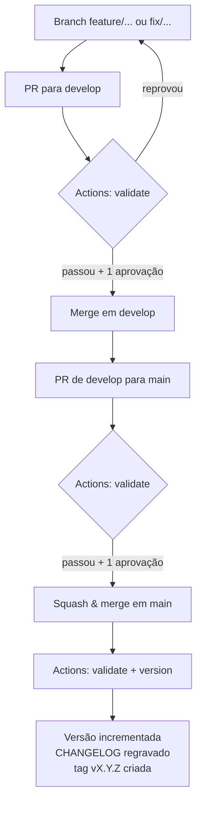

# Guia de Contribuição

Como contribuir com este repositório e, principalmente, **como escrever um commit
que apareça bem no [CHANGELOG](/CHANGELOG.md)**.

Você não escreve o changelog à mão. Você escreve boas mensagens de commit e um
bom título de Pull Request — o resto é gerado pela pipeline
([`.github/workflows/release.yml`](/.github/workflows/release.yml)).

As regras de conteúdo e o fluxo de revisão documental estão no
[AGENTS.md](/AGENTS.md); aqui o assunto é o fluxo de código e publicação.

---

## 1. O ciclo completo



O job `version` roda **apenas em `main`** e **apenas fora de PR**. Merge em
`develop` nunca publica versão — isso é intencional.

---

## 2. A mensagem de commit

Use [Conventional Commits](https://www.conventionalcommits.org/pt-br/):

```
tipo(escopo opcional): descrição no imperativo

corpo opcional explicando o porquê
```

### Onde cada tipo aparece no changelog

| Tipo | Seção do changelog | Incremento |
| --- | --- | --- |
| `feat!:` ou `BREAKING CHANGE:` no corpo | Mudanças importantes | MAJOR |
| `feat:` | Novidades | MINOR |
| `fix:` | Correções | PATCH |
| `docs:` | Documentação | PATCH |
| `chore:`, `refactor:`, `build:`, `ci:`, `test:`, `perf:`, `style:`, `revert:` | Manutenção interna | PATCH |
| qualquer outra coisa | Outras alterações | PATCH |

> `refact:` também é aceito como sinônimo de `refactor:`, porque já foi usado no
> histórico do repositório — mas prefira `refactor:` em commits novos.

### Escreva pensando em quem vai ler a versão publicada

A descrição do commit vira, literalmente, uma linha do changelog. Quem lê é
alguém decidindo se precisa mudar como trabalha — não é code review.

| Evite | Prefira |
| --- | --- |
| `fix: ajustes` | `fix: corrigir detecção de sucesso na conversão para PDF` |
| `feat: novo script` | `feat: adicionar conversor de Markdown para DOCX` |
| `docs: update` | `docs: documentar o fluxo de revisão do Projeto X` |
| `wip` | qualquer coisa com um tipo válido (senão cai em *Outras alterações*) |

O escopo, quando existir, vira destaque na entrada:
`feat(skills): adicionar skill wiki-writer` → **skills**: Adicionar skill wiki-writer.

### Mudanças importantes

Use `!` (ou `BREAKING CHANGE:` no corpo) quando a mudança **altera a forma de
trabalhar** do time — não quando ela é grande em tamanho, e sim em impacto.
Renomear uma pasta que todos os projetos derivados copiam é breaking; adicionar
um script novo não é.

---

## 3. A Pull Request

1. Abra a PR de `feature/...` para `develop`.
2. Quando `develop` estiver pronta para publicar, abra a PR de `develop` para `main`.
3. **O título da PR segue Conventional Commits** — é ele que define a versão.
4. Na descrição, responda: o quê, por quê e como testar.
5. Aguarde o job `validate` ficar verde.
6. Use **Squash and merge**.

O método de merge importa: no *squash*, o assunto do commit é o título da PR, e
é esse assunto que a pipeline analisa. Com *merge commit*, o assunto vira
`Merge pull request #N from ...` e a análise cairia sempre em PATCH.

---

## 4. Rodar as verificações antes de abrir a PR

São as mesmas do job `validate`:

```bash
cargo build --release --locked      # compila md2docx e docx_to_pdf
cargo test --locked
ruby -c scripts/changelog.rb        # sintaxe dos scripts Ruby
ruby scripts/verificar-links.rb     # links internos dos .md
ruby scripts/changelog.rb previa    # o que entraria na próxima versão
```

A prévia imprime exatamente as entradas que irão para o changelog. Se alguma
estiver em *Outras alterações* ou com texto ruim, ainda dá tempo de melhorar a
mensagem de commit (`git commit --amend` ou `git rebase -i`).

---

## 5. Como o changelog é gerado

O [`scripts/changelog.rb`](/scripts/changelog.rb) usa só a biblioteca padrão do
Ruby e o git — não há gems para instalar.

| Comando | O que faz |
| --- | --- |
| `previa` | Mostra as entradas da próxima versão, sem escrever nada |
| `plano` | Imprime `bump`, `versao`, `mudancas` e `tag_existe` (usado pela pipeline) |
| `gerar X.Y.Z` | Regrava a região gerada do `CHANGELOG.md` |
| `aplicar-versao X.Y.Z` | Atualiza a versão no `Cargo.toml` e no `Cargo.lock` |

O script analisa os commits **desde a última tag `v*`** e só reescreve o trecho
do `CHANGELOG.md` entre os marcadores `<!-- changelog:inicio -->` e
`<!-- changelog:fim -->`. O histórico abaixo do marcador final é escrito à mão e
nunca é tocado.

A seção **Não publicado** é zerada a cada publicação — o que estava nela acabou
de entrar na versão. Você pode preenchê-la à mão entre releases, mas não é
obrigatório: a prévia mostra a mesma informação.

Para forçar um incremento, use **Actions → release → Run workflow** e informe
`version_bump` como `major`, `minor` ou `patch`. Isso ignora a análise das
mensagens de commit.

---

## 6. Ativação da pipeline

Passos que precisam ser feitos **uma vez**, antes do primeiro release:

- [ ] **Criar a tag base.** O repositório ainda não tem tags, e o gerador precisa
      saber onde termina o histórico já publicado:

      git tag -a v0.1.0 -m "v0.1.0" bc46338
      git push origin v0.1.0

      Sem isso, o `changelog.rb` para com uma mensagem explicando o que fazer,
      em vez de republicar o histórico inteiro.

- [ ] **Permissão de escrita**: `permissions: contents: write` já está no
      workflow. Confira também em *Settings → Actions → General → Workflow
      permissions* se está como *Read and write*.

- [ ] **Proteção de branch em `main`**: se `main` exigir PR para receber commits,
      o push do release é rejeitado — o `GITHUB_TOKEN` padrão não fura essa
      regra. Saídas: liberar o bot em *Allow specified actors to bypass required
      pull requests*, ou criar um PAT/GitHub App com escopo `contents: write` e
      salvá-lo como o secret `RELEASE_TOKEN` (o workflow já o usa quando existe).

- [ ] **Status check**: exigir o job `validate` em `main` e `develop`.

- [ ] **Squash merging** como método padrão, para manter a regra "título define
      versão".

Sobre o `[skip ci]` no commit de release: eventos causados pelo `GITHUB_TOKEN`
padrão não disparam novos workflows, o que já evita o loop. Se você adotar
`RELEASE_TOKEN`, os eventos voltam a disparar — e aí o `[skip ci]` passa a ser o
que segura o loop.

---

## 7. Problemas comuns

| Sintoma | Causa provável | Correção |
| --- | --- | --- |
| Job `version` não aparece | Evento é `pull_request`, ou a branch não é `main` | Esperado: só publica após o merge em `main` |
| `changelog.rb` reclama de tag ausente | A tag base nunca foi criada | Item 6, primeiro passo |
| `git push` rejeitado no release | `main` protegida sem bypass | Item 6, terceiro passo |
| Sempre sobe PATCH, nunca MINOR | Merge por *merge commit* | Padronizar **Squash and merge** |
| Entradas em *Outras alterações* | Mensagens fora do Conventional Commits | Seção 2 |

---

## Referências

- [CHANGELOG](/CHANGELOG.md) — o resultado publicado
- [AGENTS.md](/AGENTS.md) — regras de documentação e fluxo de revisão
- [Conventional Commits](https://www.conventionalcommits.org/pt-br/)
- [Semantic Versioning](https://semver.org/lang/pt-BR/)
