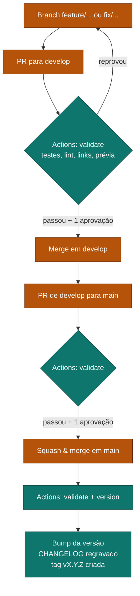

# Manual de Publicação (Release) e Changelog — GitHub

Como publicar uma nova versão da documentação e como o [CHANGELOG](CHANGELOG.md) é gerado no **GitHub**. Complementa o [CONTRIBUTING](CONTRIBUTING.md), que trata de *como contribuir*; aqui o assunto é *como publicar*.

> Template. Os nomes de sistema (`sistema-a`, `sistema-b`...) e o nome de
> repositório (`<seu-repo>`) são exemplos — troque pelos do seu projeto.

## Resposta curta

> **A Pull Request não gera o changelog.** O changelog e a versão são gerados
> **depois do merge em `main`**, automaticamente, pelo GitHub Actions.

Você não escreve o changelog. Você escreve boas mensagens de commit e um bom título de PR — o resto é automático.

---

## 1. O ciclo completo



Laranja = você faz · Verde = o Actions faz.

**Em qual etapa o changelog é escrito?** Só no job `version`, que roda apenas em
`main` e apenas fora de PR.

---

## 2. Como criar a PR de `develop` para `main`

### Passo a passo

1. No GitHub, abra **Pull requests → New pull request**.
2. **base**: `main` · **compare**: `develop`.
3. Escreva o **título seguindo Conventional Commits** — ele define a versão
   (ver tabela abaixo).
4. Na descrição, responda: **O quê? Por quê? Como testar?**
5. Aguarde o job `validate` ficar verde e obter **1 aprovação**.
6. Use **Squash and merge**.

### O título da PR define a versão

Ao fazer **Squash and merge**, o GitHub usa, por padrão, o **título da PR** como
assunto do commit de squash. A pipeline lê **esse** assunto para decidir o
incremento.

| Título da PR | Versão vai de | Para |
| --- | --- | --- |
| `feat!: reorganizar estrutura de pastas` | 1.4.2 | **2.0.0** (MAJOR) |
| `feat: adicionar fluxos do sistema-b` | 1.4.2 | **1.5.0** (MINOR) |
| `docs: revisar fluxo do sistema-a` | 1.4.2 | **1.4.3** (PATCH) |
| `Atualizações da semana` | 1.4.2 | **1.4.3** (PATCH — regra padrão) |

Use `!` (ou `BREAKING CHANGE:` na descrição) quando a mudança **altera a forma de
trabalhar** do time — não para mudanças grandes em tamanho, e sim em impacto.

> **O método de merge importa no GitHub:**
> - **Squash and merge** → assunto do commit = título da PR. **Recomendado**,
>   pois preserva a regra "título define versão".
> - **Create a merge commit** → o assunto vira `Merge pull request #N from ...`
>   e o título vai para o corpo; a análise sempre cairia em PATCH se só ler o
>   assunto.
> - **Rebase and merge** → entram as mensagens de cada commit, uma a uma.
>
> Padronize o repositório em Squash (item 6.2) para não depender de disciplina.

### Antes de abrir a PR, confira o que será publicado

```bash
npm run changelog:previa
```

Isso imprime exatamente as entradas que entrarão no changelog. Se alguma estiver
em *Outras alterações* ou com texto ruim, ainda dá tempo de melhorar as mensagens
de commit.

---

## 3. O que acontece automaticamente após o merge

O push em `main` (resultado do squash) dispara o workflow. Ele roda dois jobs em
sequência:

### Job `validate`

| Passo | Comando |
| --- | --- |
| Testes unitários | `npm test` |
| Lint de Markdown | `npm run lint:md` |
| Forma canônica dos canvas | `npm run canvas:verificar` |
| Links internos | `npm run lint:links` |
| Prévia do changelog | `npm run changelog:previa` |

### Job `version` (só em `main`, só em evento `push`)

1. `git fetch --tags`
2. Calcula o incremento a partir da última mensagem de commit
3. `npm version <bump> --no-git-tag-version` → atualiza `package.json`
4. **Regrava o `CHANGELOG.md`** com a nova versão e a data
5. Commita como `chore(release): X.Y.Z [skip ci]`
6. Cria a tag anotada `vX.Y.Z`
7. Faz push do commit e da tag

Esqueleto do workflow (`.github/workflows/release.yml`):

```yaml
on:
  push:
    branches: [main, develop]
  pull_request:
  workflow_dispatch:
    inputs:
      version_bump:
        description: "major | minor | patch (força o incremento)"
        required: false

permissions:
  contents: write        # necessário para o push do release

jobs:
  validate:
    runs-on: ubuntu-latest
    steps:
      - uses: actions/checkout@v4
      - run: npm ci
      - run: npm test
      - run: npm run lint:md
      - run: npm run canvas:verificar
      - run: npm run lint:links
      - run: npm run changelog:previa

  version:
    needs: validate
    if: github.ref == 'refs/heads/main' && github.event_name != 'pull_request'
    runs-on: ubuntu-latest
    steps:
      - uses: actions/checkout@v4
        with:
          fetch-depth: 0
          token: ${{ secrets.RELEASE_TOKEN }}   # ver item 6.1
      # ... calcula bump, npm version, regrava CHANGELOG, commit + tag + push
```

### `[skip ci]` e o loop

O `[skip ci]` no commit de release evita que a pipeline dispare de novo.

No GitHub há uma sutileza que vale saber: **eventos causados pelo `GITHUB_TOKEN`
padrão não disparam novos workflows** — isso já previne o loop sozinho. Mas se
você usar um Personal Access Token ou GitHub App (necessário para furar a proteção
de branch — item 6.1), aí os eventos **voltam a disparar** workflows, e o
`[skip ci]` passa a ser o que segura o loop.

### Por que a PR não gera o changelog

Se cada PR editasse o `CHANGELOG.md`, **toda PR conflitaria com toda outra PR**
no mesmo arquivo. Por isso há um único escritor: a `main`. Nos PRs a pipeline só
mostra a prévia no log. Decisão ainda a registrar em ADR dedicado
(`pendente-validacao`).

---

## 4. Como conferir que deu certo

Depois que o workflow terminar, em `main`:

- **Code → CHANGELOG.md** — deve ter um bloco novo `## X.Y.Z — data`
- **Code → Tags** (ou **Releases**) — deve existir `vX.Y.Z`
- **package.json** — campo `version` atualizado
- O histórico deve ter o commit `chore(release): X.Y.Z [skip ci]`

---

## 5. Casos especiais

### Forçar um incremento específico

Em **Actions → (workflow) → Run workflow**, informe o input:

| Input | Valores aceitos |
| --- | --- |
| `version_bump` | `major`, `minor`, `patch` |

Isso ignora a análise da mensagem de commit.

### A tag já existe

A pipeline detecta e encerra sem publicar, sem quebrar o build. Acontece quando
a mesma versão já foi publicada — normalmente por reexecução.

### O job `version` não rodou

Ele só roda quando **todas** estas condições são verdadeiras:

- o job `validate` passou;
- o evento **não** é `pull_request`;
- a ref é exatamente `refs/heads/main`.

Merge em `develop`, por exemplo, nunca publica versão — e isso é intencional.

---

## 6. O que precisa ser configurado no GitHub

O workflow **escreve de volta no repositório** (commit do changelog + tag). Sem
as permissões abaixo, o job `version` falha no `git push` com erro de permissão
ou de proteção de branch.

### 6.1. Permissão de escrita e o problema da branch protegida

Duas coisas são necessárias, e a segunda costuma ser a pegadinha:

1. **Escrita pelo workflow.** Declare `permissions: contents: write` no YAML (ou
   em **Settings → Actions → General → Workflow permissions → Read and write**).

2. **Furar a exigência de PR em `main`.** Se `main` exige PR para receber commits
   (item 6.2), o push automático é rejeitado. O `GITHUB_TOKEN` padrão **não**
   consegue burlar isso. Escolha uma das saídas:

   | Opção | Como |
   | --- | --- |
   | **Bypass por ator** | Branch protection → *Allow specified actors to bypass required pull requests* → adicione o app/bot |
   | **PAT / GitHub App** | Crie um token com escopo `repo` (ou App com `contents: write`), salve como secret `RELEASE_TOKEN` e passe no `actions/checkout` (`token: ${{ secrets.RELEASE_TOKEN }}`) |

   Lembre-se: se usar PAT/App, o `[skip ci]` volta a ser essencial (ver seção 3).

### 6.2. Proteção de branch

**Settings → Branches → Branch protection rules**, para `main` (e o equivalente
em `develop`):

| Regra | Configuração sugerida |
| --- | --- |
| Require a pull request before merging | Ativado, **1 aprovação** |
| Require status checks to pass | Adicionar o job `validate` |
| Require conversation resolution | Ativado |

E em **Settings → General → Pull Requests**: deixe **Allow squash merging** como
único (ou padrão) para manter a regra "título define versão".

### 6.3. Secret do token

Se optou por PAT/App (item 6.1), salve-o em **Settings → Secrets and variables →
Actions → New repository secret**, com o nome `RELEASE_TOKEN`. O
`actions/checkout` deve receber esse token para que o `git push` do release
tenha permissão.

### 6.4. Checklist de ativação

- [ ] `permissions: contents: write` no workflow (ou Workflow permissions = R/W)
- [ ] Estratégia de bypass definida (ator autorizado **ou** `RELEASE_TOKEN`)
- [ ] Status check `validate` exigido em `main` e `develop`
- [ ] Mínimo de 1 revisor em `main`
- [ ] Squash merging como método padrão
- [ ] Rodar um merge de teste e conferir se a tag e o `CHANGELOG.md` apareceram

---

## 7. Solução de problemas

| Sintoma | Causa provável | Correção |
| --- | --- | --- |
| Job `version` não aparece | Evento `pull_request`, ou branch diferente de `main` | Esperado. Só publica após o merge em `main` |
| `git push` falha com erro de permissão | Falta `contents: write` | Item 6.1 |
| `git push` rejeitado por regra de proteção | `main` exige PR e não há bypass | Ator autorizado ou `RELEASE_TOKEN` (item 6.1) |
| Tag não foi criada | `git push` da tag sem permissão de escrita | Item 6.1 |
| Versão subiu MINOR sem querer | `feat:` no título da PR (ou no corpo, em merge commit) | Revisar o título; padronizar Squash |
| Sempre sobe PATCH, nunca MINOR/MAJOR | Merge por *merge commit*: assunto é `Merge pull request...` | Padronizar **Squash and merge** (item 6.2) |
| Pipeline entrou em loop | Release feito com PAT/App e sem `[skip ci]` | Garantir `[skip ci]` no commit de release |
| Entradas do changelog em *Outras alterações* | Mensagens fora do Conventional Commits | Ver [CONTRIBUTING](CONTRIBUTING.md) |

---

## Referências

- [CONTRIBUTING](CONTRIBUTING.md) — como escrever commits que aparecem bem no changelog
- [CHANGELOG](CHANGELOG.md) — o resultado publicado
- [ADR 0001](adr/0001-versionamento-automatizado-pipeline.md) — versionamento automatizado
- ADR de changelog automatizado — decisões do changelog (`pendente-validacao`: ainda não escrito)
- [Conventional Commits](https://www.conventionalcommits.org/)
- [Semantic Versioning](https://semver.org/)
- [GitHub Actions — permissions](https://docs.github.com/actions/using-jobs/assigning-permissions-to-jobs)
