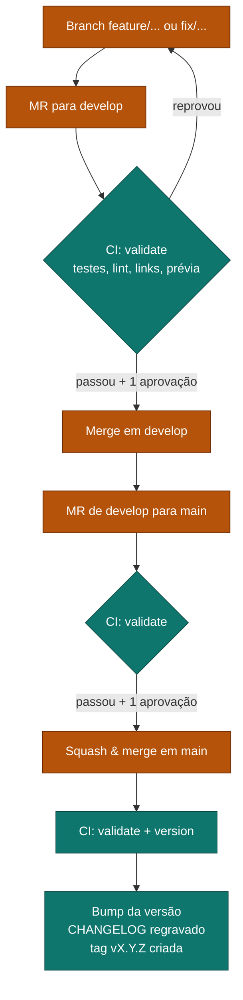

# Manual de Publicação (Release) e Changelog — GitLab

Como publicar uma nova versão da documentação e como o [CHANGELOG](CHANGELOG.md) é gerado no **GitLab**. Complementa o [CONTRIBUTING](CONTRIBUTING.md), que trata de *como contribuir*; aqui o assunto é *como publicar*.

> Template. Os nomes de sistema (`sistema-a`, `sistema-b`...) e o nome de
> repositório são exemplos — troque pelos do seu projeto.

## Resposta curta

> **O Merge Request não gera o changelog.** O changelog e a versão são gerados
> **depois do merge em `main`**, automaticamente, pelo GitLab CI.

Você não escreve o changelog. Você escreve boas mensagens de commit e um bom título de MR — o resto é automático.

---

## 1. O ciclo completo



Laranja = você faz · Verde = o CI faz.

**Em qual etapa o changelog é escrito?** Só no job `version`, que roda apenas em
`main` e apenas fora de pipeline de MR.

---

## 2. Como criar o MR de `develop` para `main`

### Passo a passo

1. No GitLab, abra **Merge requests → New merge request**.
2. **Source**: `develop` · **Target**: `main`.
3. Escreva o **título seguindo Conventional Commits** — ele define a versão
   (ver tabela abaixo).
4. Na descrição, responda: **O quê? Por quê? Como testar?**
5. Aguarde o job `validate` ficar verde e obter **1 aprovação**.
6. Marque **Squash commits** e faça o **Merge**.

### O título do MR define a versão

Com **Squash commits** ativado, o GitLab usa, por padrão, o **título do MR** como
mensagem do commit de squash. A pipeline lê **essa** mensagem para decidir o
incremento.

| Título do MR | Versão vai de | Para |
| --- | --- | --- |
| `feat!: reorganizar estrutura de pastas` | 1.4.2 | **2.0.0** (MAJOR) |
| `feat: adicionar fluxos do sistema-b` | 1.4.2 | **1.5.0** (MINOR) |
| `docs: revisar fluxo do sistema-a` | 1.4.2 | **1.4.3** (PATCH) |
| `Atualizações da semana` | 1.4.2 | **1.4.3** (PATCH — regra padrão) |

Use `!` (ou `BREAKING CHANGE:` na descrição) quando a mudança **altera a forma de
trabalhar** do time — não para mudanças grandes em tamanho, e sim em impacto.

> **O método de merge importa no GitLab:**
> - **Squash commits** → mensagem do commit = título do MR. **Recomendado**,
>   pois preserva a regra "título define versão".
> - **Merge commit** sem squash → o assunto vira `Merge branch '...' into 'main'`
>   e o título do MR entra apenas no corpo; a análise que só lê o assunto sempre
>   cairia em PATCH.
>
> Padronize o projeto em Squash (item 6.2) para não depender de disciplina.

### Antes de abrir o MR, confira o que será publicado

```bash
npm run changelog:previa
```

Isso imprime exatamente as entradas que entrarão no changelog. Se alguma estiver
em *Outras alterações* ou com texto ruim, ainda dá tempo de melhorar as mensagens
de commit.

---

## 3. O que acontece automaticamente após o merge

O push em `main` (resultado do squash) dispara a pipeline. Ela roda dois stages
em sequência:

### Stage `validate`

| Passo | Comando |
| --- | --- |
| Testes unitários | `npm test` |
| Lint de Markdown | `npm run lint:md` |
| Forma canônica dos canvas | `npm run canvas:verificar` |
| Links internos | `npm run lint:links` |
| Prévia do changelog | `npm run changelog:previa` |

### Stage `version` (só em `main`, só fora de pipeline de MR)

1. `git fetch --tags`
2. Calcula o incremento a partir da última mensagem de commit
3. `npm version <bump> --no-git-tag-version` → atualiza `package.json`
4. **Regrava o `CHANGELOG.md`** com a nova versão e a data
5. Commita como `chore(release): X.Y.Z [skip ci]`
6. Cria a tag anotada `vX.Y.Z`
7. Faz push do commit e da tag usando o `RELEASE_TOKEN`

Esqueleto do `.gitlab-ci.yml`:

```yaml
stages: [validate, version]

validate:
  stage: validate
  image: node:20
  script:
    - npm ci
    - npm test
    - npm run lint:md
    - npm run canvas:verificar
    - npm run lint:links
    - npm run changelog:previa

version:
  stage: version
  image: node:20
  rules:
    # roda só em main, e nunca em pipeline de MR
    - if: '$CI_COMMIT_BRANCH == "main" && $CI_PIPELINE_SOURCE != "merge_request_event"'
  variables:
    GIT_DEPTH: "0"          # histórico completo para calcular o bump
  before_script:
    # RELEASE_TOKEN = Project Access Token com write_repository (item 6.1)
    - git remote set-url origin "https://oauth2:${RELEASE_TOKEN}@${CI_SERVER_HOST}/${CI_PROJECT_PATH}.git"
    - git config user.email "ci@${CI_SERVER_HOST}"
    - git config user.name  "release-bot"
  script:
    - git fetch --tags
    # ... calcula bump, npm version, regrava CHANGELOG
    - git commit -am "chore(release): ${VERSION} [skip ci]"
    - git tag -a "v${VERSION}" -m "v${VERSION}"
    - git push origin HEAD:main
    - git push origin "v${VERSION}"
```

O `[skip ci]` no commit de release evita que a pipeline dispare de novo — no
GitLab isso é obrigatório, porque o push é feito com um token de usuário e
**dispararia** uma nova pipeline sem ele.

### Por que o MR não gera o changelog

Se cada MR editasse o `CHANGELOG.md`, **todo MR conflitaria com todo outro MR**
no mesmo arquivo. Por isso há um único escritor: a `main`. Nos MRs a pipeline só
mostra a prévia no log. Decisão ainda a registrar em ADR dedicado
(`pendente-validacao`).

---

## 4. Como conferir que deu certo

Depois que a pipeline terminar, em `main`:

- **Repository → Files → CHANGELOG.md** — deve ter um bloco novo `## X.Y.Z — data`
- **Repository → Tags** — deve existir `vX.Y.Z`
- **package.json** — campo `version` atualizado
- O histórico deve ter o commit `chore(release): X.Y.Z [skip ci]`

---

## 5. Casos especiais

### Forçar um incremento específico

Em **Build → Pipelines → Run pipeline**, adicione a variável:

| Variável | Valores aceitos |
| --- | --- |
| `VERSION_BUMP` | `major`, `minor`, `patch` |

Isso ignora a análise da mensagem de commit.

### A tag já existe

A pipeline detecta e encerra sem publicar, sem quebrar o build. Acontece quando
a mesma versão já foi publicada — normalmente por reexecução.

### O stage `version` não rodou

Ele só roda quando **todas** estas condições são verdadeiras:

- o stage `validate` passou;
- a pipeline **não** é de merge request (`$CI_PIPELINE_SOURCE != "merge_request_event"`);
- a branch é exatamente `main` (`$CI_COMMIT_BRANCH == "main"`).

Merge em `develop`, por exemplo, nunca publica versão — e isso é intencional.

---

## 6. O que precisa ser configurado no GitLab

A pipeline **escreve de volta no repositório** (commit do changelog + tag). O
`CI_JOB_TOKEN` padrão **não** tem permissão de push, então é preciso um token
próprio. Sem isso, o stage `version` falha no `git push` com erro de
autenticação ou de branch protegida.

### 6.1. Token de escrita (Project Access Token)

O caminho recomendado é um **Project Access Token**:

1. **Settings → Access Tokens → Add new token**.
2. Escopo **`write_repository`**, role **Maintainer**.
3. Copie o valor e salve em **Settings → CI/CD → Variables** como `RELEASE_TOKEN`
   (marque **Masked** e **Protected**).
4. No `.gitlab-ci.yml`, reescreva o `origin` com esse token (ver esqueleto na
   seção 3).

> Alternativas: **Deploy Token** com `write_repository`, ou um **Group/Personal
> Access Token**. O importante é ter `write_repository` e uma identidade com
> permissão de push na branch protegida (item 6.2).

### 6.2. Branches protegidas

**Settings → Repository → Protected branches**, para `main` (e o equivalente em
`develop`):

| Configuração | Valor sugerido |
| --- | --- |
| Allowed to merge | Maintainers |
| Allowed to push and merge | Adicionar a identidade do `RELEASE_TOKEN` (Maintainer) |
| Allowed to force push | **Não** |

A identidade que faz o push do release **precisa** estar em *Allowed to push and
merge*, senão a branch protegida rejeita o push automático — é a causa mais comum
de falha nesse stage.

### 6.3. Merge request: squash e aprovação

**Settings → Merge requests**:

| Configuração | Valor sugerido |
| --- | --- |
| Squash commits when merging | **Require** (ou Encourage) — mantém "título define versão" |
| Merge method | Merge commit / Fast-forward, conforme preferência do time |

E em **Settings → Merge requests → Approvals** (ou Approval rules): exija
**1 aprovação** para `main`.

### 6.4. Acesso da pipeline ao repositório

O clone padrão usa `CI_JOB_TOKEN`. Para o push, o `origin` é reescrito com o
`RELEASE_TOKEN` (seção 3). Se a organização restringe o `CI_JOB_TOKEN`
(**Settings → CI/CD → Token Access**), isso não afeta o push do release, que usa
o `RELEASE_TOKEN` — mas confirme que o job consegue clonar o próprio projeto.

### 6.5. Checklist de ativação

- [ ] `RELEASE_TOKEN` (Project Access Token, `write_repository`) salvo em CI/CD Variables, Masked + Protected
- [ ] Identidade do token em *Allowed to push and merge* de `main`
- [ ] `.gitlab-ci.yml` reescrevendo o `origin` com o token
- [ ] Squash exigido (ou encorajado) nos MRs
- [ ] Mínimo de 1 aprovação em `main`
- [ ] Rodar um merge de teste e conferir se a tag e o `CHANGELOG.md` apareceram

---

## 7. Solução de problemas

| Sintoma | Causa provável | Correção |
| --- | --- | --- |
| Stage `version` não aparece | Pipeline de MR, ou branch diferente de `main` | Esperado. Só publica após o merge em `main` |
| `git push` falha com `401`/`403` | `CI_JOB_TOKEN` sem push, ou `RELEASE_TOKEN` ausente | Item 6.1 |
| `git push` rejeitado por branch protegida | Identidade do token fora de *Allowed to push and merge* | Item 6.2 |
| Tag não foi criada | Token sem `write_repository` | Item 6.1 |
| Versão subiu MINOR sem querer | `feat:` no título do MR (ou no corpo, em merge sem squash) | Revisar o título; exigir Squash |
| Sempre sobe PATCH, nunca MINOR/MAJOR | Merge sem squash: assunto é `Merge branch...` | Exigir **Squash commits** (item 6.3) |
| Pipeline entrou em loop | Commit de release sem `[skip ci]` | Garantir `[skip ci]` na mensagem do commit de release |
| Entradas do changelog em *Outras alterações* | Mensagens fora do Conventional Commits | Ver [CONTRIBUTING](CONTRIBUTING.md) |

---

## Referências

- [CONTRIBUTING](CONTRIBUTING.md) — como escrever commits que aparecem bem no changelog
- [CHANGELOG](CHANGELOG.md) — o resultado publicado
- [ADR 0001](adr/0001-versionamento-automatizado-pipeline.md) — versionamento automatizado
- ADR de changelog automatizado — decisões do changelog (`pendente-validacao`: ainda não escrito)
- [Conventional Commits](https://www.conventionalcommits.org/)
- [Semantic Versioning](https://semver.org/)
- [GitLab — Push to a protected branch from CI](https://docs.gitlab.com/ci/jobs/ci_job_token/)
