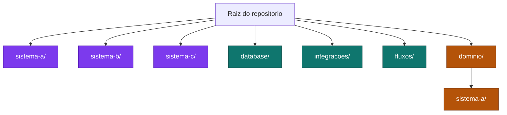
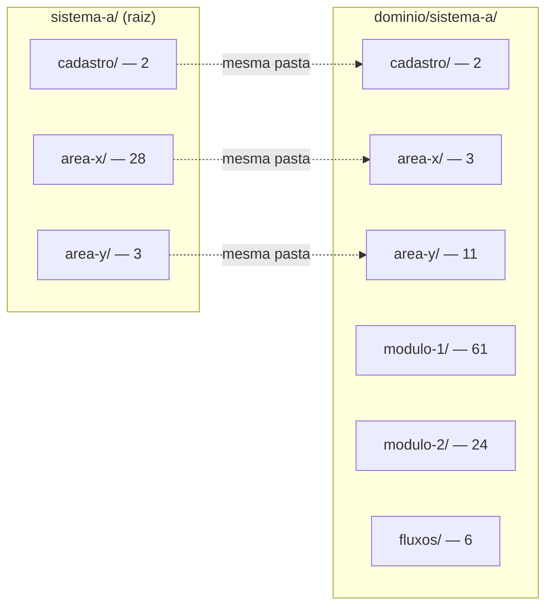
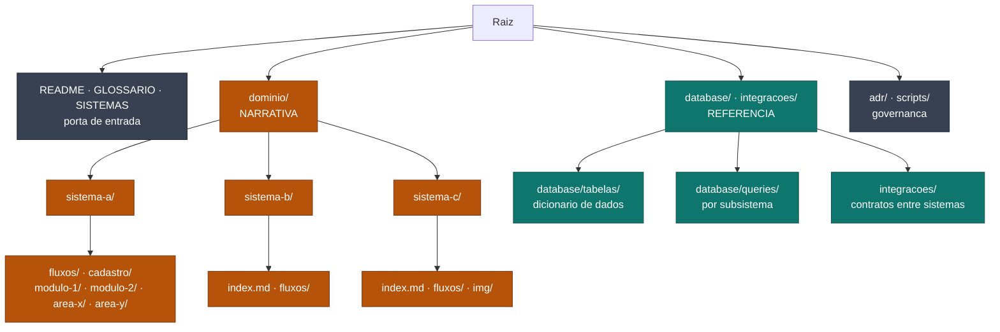
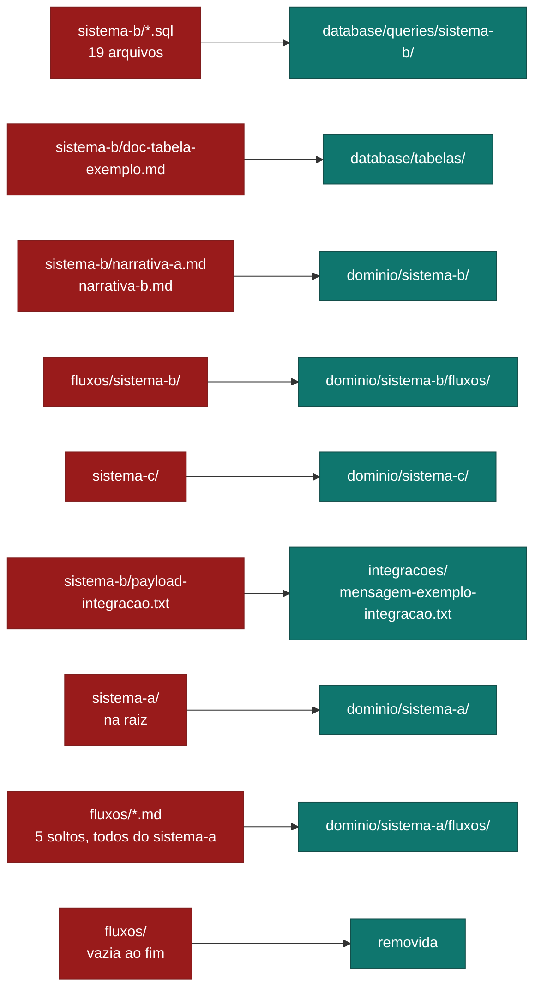
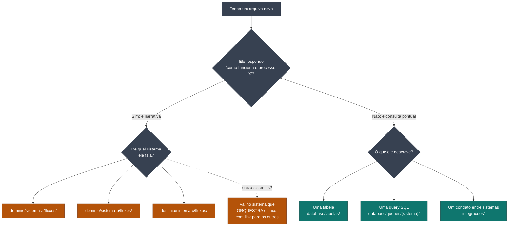
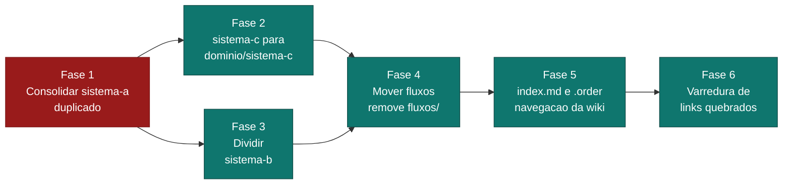

# ADR 0002 - Diagramas da arquitetura proposta

> Template de ADR. Complemento visual do
> [ADR 0002 - organizacao](0002-organizacao-orientada-a-dominio.md). Os nomes de
> sistema e as contagens sao exemplos ilustrativos; troque pelos do seu projeto.

Os diagramas 1 e 2 registram o estado **anterior** a migracao, para consulta
historica. Os diagramas 3 a 6 refletem o estado alvo e o que falta.

## 1. Estado atual: tres criterios competindo

O problema nao e "pasta solta". E que tres criterios de organizacao diferentes
ocupam o mesmo nivel da arvore, entao nao ha como prever onde procurar.

Legenda: roxo = organizado **por sistema** · verde = **por tipo de artefato** ·
laranja = **por dominio**.

`sistema-c/` e `sistema-b/` parecem soltas porque seguem o criterio roxo enquanto
suas vizinhas seguem o verde. O criterio laranja existe mas contem so um sistema.

## 2. A duplicacao mais grave

`sistema-a` existe em dois lugares, com as mesmas subpastas e divisao arbitraria
de conteudo.

Nao e "antigo vs novo": `area-x` tem 28 na raiz e 3 no dominio, `area-y` tem o
inverso. Nenhum leitor sabe qual e o canonico.

## 3. Estrutura proposta

Duas perguntas cobrem o repositorio inteiro: **de qual sistema?** e
**narrativa ou referencia?**

`dominio/` espelha os sistemas declarados em `SISTEMAS.md`. Referencia fica
compartilhada porque varios fluxos apontam para a mesma tabela, e porque
integracao e por definicao *entre* sistemas.

## 4. Mapa de movimentacao

De onde cada coisa sai e para onde vai.

## 5. Onde eu coloco meu arquivo?

Arvore de decisao para quem vai contribuir — inclusive quem nao e tecnico.

## 6. Ordem de execucao das fases

Cada fase e uma PR independente. A dependencia importa: consolidar a duplicacao
vem antes de tudo, senao as fases seguintes movem conteudo ambiguo.

Fase 1 em vermelho por ser bloqueante. Fases 2 e 3 podem correr em paralelo.
